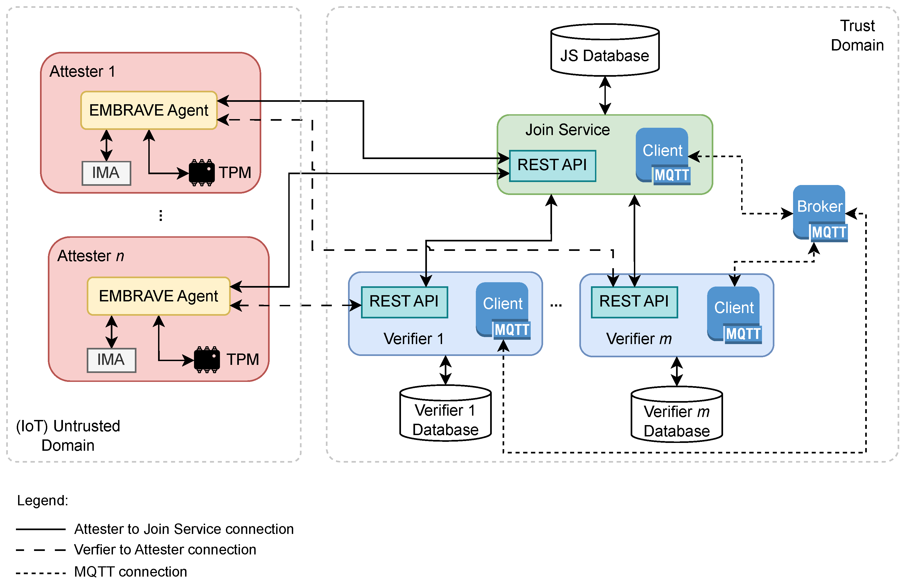

# Overview

EMBRAVE is a TPM-based RA framework oriented to dynamic IoT networks where IoT platforms can join and leave the network at any time.
The figure shows the modular architecture of EMBRAVE, where multiple Attesters can be attested and multiple Verifiers can be deployed. The architecture comprises an Untrusted Domain, where all IoT platforms reside, and a Trust Domain under the admin control, where the Join Service and Verifiers reside. The communication between components is managed with REST APIs and MQTT messages. REST APIs are mainly used to communicate outside and inside the Trust Domain, while MQTT is used only in the Trust Domain.
The Join Service, the EMBRAVE Agents installed on the IoT platforms, the Verifiers, and the MQTT Broker are the main components of the EMBRAVE architecture. These components interact in compliance with two protocols: a novel Join Protocol and the Remote Attestation Protocol compliant with TCG recommendations. The following sections describe the role of each component and present newly designed interactions between them.
