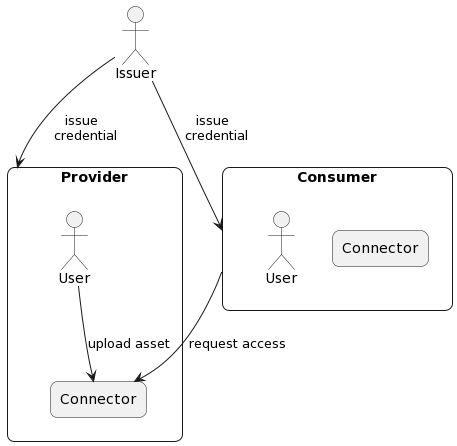

# Mediterraneus

A new decentralized asset marketplace with built-in **Self-Sovereign Identity**.

## Introduction

This white paper introduces the Mediterraneous protocol as a collection of building blocks for developing secure and decentralised ecosystems where users can offer and purchase any digital service, in accordance with the [Web3 paradigm](https://ethereum.org/en/web3/). The adoption of the Mediterraneous protocol provides the ecosystem built upon it with several fundamental principles.

Users promote and deliver their services in a decentralised way. Each user has full control over their services and the power to deliver them using the technology of their choice. This design avoids the need to adhere to the specifications typically imposed by a central computing platform. In this sense, a Mediterraneous protocol-based ecosystem is *self-organising*. The overall behavior of the ecosystem is not enforced but it arises from the deliberate interactions among the users without the need of an orchestrating entity.


Users sell access to their services maintaining *ownership* control. Each user, acting as a provider, can set the access price and define different access options for their service (e.g., one-time, perpetual, time-bound, or any other). 
Additionally, users can act as consumers and purchase any service, then access it by proving their digital identity and their purchase. 
The process of publishing service offers and facilitating interactions between provider and consumer is mediated by an architecture of smart contracts deployed on a Smart Contract Platform.
Providers offer their services and ensure discoverability and access. Discoverability is facilitated by minting [*non-fungible tokens* (NFTs)](https://eips.ethereum.org/EIPS/eip-721) representing the services, while access is then granted through purchasing *service tokens* (ST), which are [ERC-20](https://eips.ethereum.org/EIPS/eip-20) also minted by the provider.


The resulting peer-to-peer ecosystem embraces the *trustless* principle. There is no need for a central entity to ensure trust between peers, to complete transactions and to gain access to the intended services. The distributed ledger and smart contracts allow interactions in a fully decentralised way.


The Mediterraneous protocol embraces the principle of Self-Sovereign Identity (SSI) instead of relying on pseudonyms.
The SSI is integrated into the protocol's core to ensure the protocol natively supports SSI principles [[w3c-did](https://www.w3.org/TR/did-core/),[w3c-vc](https://www.w3.org/TR/vc-data-model-2.0/)]. 
Users autonomously manage their identities using a digital wallet containing verifiable credentials, ensuring a non-custodial approach.
Apart from joining the ecosystem, all other interactions, both on-chain (i.e., publishing a service offer and buying access to a service) and off-chain (i.e., using a potential catalogue service and consuming a service), require prior user identity verification following the SSI model. 


Upon adhering to the Mediterraneous protocol, no entity can prevent anyone in the ecosystem from interacting according to the *censorship-resistant* principle.
A malicious user can always deny off-chain access to another user attempting to consume the purchased service, but they do so at the risk of being labelled as untrustworthy themselves.
 <!-- The operating principles of the \verb+Mediterranean+ protocol reduce the incentives to break the rules and give the users the power to contribute to the self-organization of the ecosystem.  -->
In addition, using zero-knowledge proof techniques, such as anonymous and selective disclosure, on verifiable credentials ensures *privacy preservation*. This empowers users to select their desired level of privacy when interacting with others within the ecosystem.

Integrating the SSI model at the core of the Mediterraneous protocol provides a distinctive value proposition. The adoption of the Mediterraneous protocol enables an Internet of digital services, owned by their creators and accessed by users through their interoperable, privacy-preserving and decentralized digital identity.

## Related work

The closest work to the Mediterraneous protocol is the [Ocean protocol](https://oceanprotocol.com/tech-whitepaper.pdf). While Ocean offers a comprehensive framework for launching new data marketplaces, including tools and sustainable tokenomics principles, the Mediterraneous protocol focuses on the core technologies enabling decentralized service trading and integrates the SSI model at its core [[w3c-did](https://www.w3.org/TR/did-core/),[w3c-vc](https://www.w3.org/TR/vc-data-model-2.0/)]. 

By design, the Mediterraneous protocol embraces SSI principles, enabling decentralized access control with fine-grained permission capabilities. With their digital identities, users operate within the ecosystem independently, without a central authority controlling access to marketplace functions or service providers. Leveraging the SSI model, users possess a rich and decentralized digital identity, retaining full control over the data they use to build and verify their credentials.

In the Ocean protocol, users' identities are tied to their [Externally Owned Account (EOA)](https://ethereum.org/developers/docs/accounts) they use to interact with the marketplace; it is a pseudonym, not a rich identity. The Ocean protocol is privacy-preserving in this sense, but when it comes to access control, it requires a central, old-style Role-Based Access Control (RBAC) server and access & deny lists. Within the Mediterraneous protocol, leveraging verifiable credentials enables flexible access control mechanisms compared to other approaches.

In the Mediterraneus protocol, when credentials are issued, the Issuer creates a link between the user's EOA and the credential, storing this binding in a particular SC, as explained in Section [#Smart Contracts]. This mechanism, as outlined in Section [sec:protocol], facilitates access control within the on-chain ecosystem functionalities by verifying EOA ownership and grants access control to off-chain services through the presentation of credentials.

Both Ocean Protocol and Mediterraneous Protocol utilize [ERC-20](https://eips.ethereum.org/EIPS/eip-20) tokens to enable consumers to access assets and services offered by providers. While both can support various access models like perpetual, time-bound, and one-time options, a key difference lies in identity verification. In the Mediterraneous ecosystem, consumers must prove their identity using verifiable credentials to the provider, ensuring adherence to the protocol.

The Mediterraneus protocol serves as the initial step in safeguarding and enhancing user privacy through Zero-Knowledge solutions, particularly within the realm of credentials, which cannot be adequately addressed solely through pseudonymity.

## Actors

The actors involved in the Mediterraneus ecosystem are described below, and their interactions are depicted in Figure [fig-actors].

- **Issuer** is the entity in charge of issuing Verifiable Credentials (VCs). Issuer asserts claims about users, creates credentials based on those claims, and issues them to the user. Issuers operate according to the SSI model. They are also responsible for deploying Smart Contracts (SCs) in the Mediterraneus ecosystem and maintaining revocation and activation status lists within the Identity SC, as explained in Sections [sec:smart-contracts] and [sec:protocol].

- **User** is each member of the Mediterraneus ecosystem who provides and/or consumes assets. Users interact with the ecosystem through their browsers and connectors. A **Connector** is an agent system that performs operations on behalf of a user. The connector provides permanent, secure storage for identity data and allows providers to upload and manage their assets. Providers can tokenize one or more assets to make them purchasable by other users in the Mediterraneus ecosystem. Consumers use their own crypto wallets to authorise payment transactions for buying access to providers' assets. Providers' connectors act as verifiers when a consumer tries to access an asset, permitting access only to consumers who have purchased it.  

- **Front-end** is the main interface of the ecosystem and it provides all the functionalities for the users to build their self-sovereign identity and to operate in the decentralized ecosystem of service assets. The Connector, Catalogue and the Issuer are the back-end, together with the decentralized back-end, i.e. the smart contracts.

The **Catalogue** is a service that collects all offered assets within the Mediterraneus ecosystem. Users can discover, filter, or query the Catalogue to find their desired assets.


<!-- \begin{figure}
    \centering
    \includegraphics[width=0.4\columnwidth]{./figures/actors.png}
    \caption{Simplified interactions between Actors in the Mediterraneus ecosystem}
    \label{fig:actors}
\end{figure} -->

<!-- Diagram code -->

```
@startuml
 skinparam roundCorner 15

 actor Issuer as I
 rectangle Consumer as C {
  agent "Connector" as CC
  actor User as UC
 }

 rectangle Provider as P {
  agent  "Connector" as CP
  actor User as UP
 }

 I --> C : "issue \n credential"
 I --> P : "issue \n credential"
 C --> CP : request access
 UP --> CP : upload asset
@enduml
```

## Infrastructure

The Mediterraneus protocol relies on the following three components:  
- **Verifiable Data Registry** (VDR): is a system recording [Decentralized Identifiers (DIDs)](https://www.w3.org/TR/did-core/), public keys, and data, crucial for using verifiable credentials, acting as a trusted source for all the entities and being tamper-evident. Examples include distributed ledgers, decentralized file systems and other forms of trusted data storage,

- **Distributed Data Storage**: serves as a repository for any kind of data, readily accessible by all participants within the ecosystem. Its primary function is to avoid the use of distributed ledgers for storing large information, thereby mitigating the associated high storage costs and latency inherent in write operations on such ledgers,

- **Smart Contract Platforms** (SCPs): are decentralized platforms offering a layer for deploying smart-contract-based applications. These applications provide decentralized, trustless computation within the ecosystem. Ethereum is the most well-known example of an SCP.

These components can reside on the same infrastructure or even on different, independent ones.
The Mediterraneus protocol is theoretically functional with any implementation of the three aforementioned components. 
However, the current implementation utilizes the IOTA distributed ledger [iota] for VDR, the InterPlanetary File System (IPFS) [ipfs] for Distributed Data Storage, and EVM-based [evm] IOTA Smart Contracts [isc] as SCP. This choice suggests leveraging the IOTA Identity [iota-identity] framework for managing digital identities within the SSI model, ensuring compliance with its standards.

## Smart Contracts

Smart Contracts (SCs) are software applications deployed on an immutable ledger. This means that once published, their code cannot be altered. Notably, these contracts operate on a decentralized network of computers (called validators) that execute and validate the same code, ensuring identical outcomes regardless of the validator. The following SCs deployed on the SC platform enable the Mediterraneus ecosystem with several features.

- **Identity SC** is the key contract that maintains the binding between a user's SSI and their EOA on the SC platform. Other contracts can interact with the Identity SC to authorize access to specific Mediterraneus services (e.g., asset tokenization, purchase of service tokens) based on a user's digital identity. The Issuer deploys and owns this contract. Considering that on-chain validation can be challenging for several reasons: cryptographic operations are expensive, SC platforms and VDR are not always operated on the same underlying infrastructure, and presentations and credentials may contain sensitive information which should not be directly exposed on the SC platform through transactions with SCs, compromising confidentiality. The Identity SC allows the Issuer to manage the metadata of issued credentials. This information enables authorized entities and smart contracts to verify these credentials' status (e.g., expiration and revocation) directly on the SCP. In case a credential expires or is revoked due to various reasons, the Issuer updates the relevant data within the Identity SC, allowing actors to easily access this information [w3c-status-list]. Verifiable presentations and credentials can be fully validated and cryptographically verified through a direct, secure communication channel between the holder and the verifier, i.e. off-chain. 

- **Factory SC** uses the factory pattern to deploy new instances of other contracts, specifically Asset SCs and Service Token SCs. Users who hold a valid identity within the Mediterraneus ecosystem, confirmed by the Factory SC interacting with the Identity SC, can deploy new contracts. When a provider wants to sell an asset, they use the Factory SC to create and deploy smart contracts representing the tokenized asset. After deployment, the Factory SC transfers the ownership of these new contracts to the provider and emits an event signalling successful tokenization, which can be detected by catalogue services that help users discover these assets. The Factory SC also keeps track of all deployed SC instances, simplifying the process of finding tokenized assets.

- **Asset SC**: an ERC-721 compliant contract [eip-721], also known as NFT, which represents a provider's tokenized asset. The Factory SC deploys a new instance of this contract type each time a provider wants to tokenize and sell an asset. Each contract instance holds the relevant asset information.

- **Service Token SC**: an ERC-20 compliant contract [eip-20] representing access to a provider's offered asset. To access or consume the service, a user must purchase and hold a token of this type. The Factory SC deploys a new instance of this contract each time a provider wants to tokenize and sell an asset. The provider also determines the number of ERC-20 tokens (Service Tokens) to be minted.

- **Router SC**: maintains a registry of all active exchange contracts. It also provides functionalities for adding or removing exchange contracts. Currently, only fixed-rate exchanges are implemented.

- **Fixed-Rate Exchange SC**: this contract acts as an exchange. When tokenizing an asset through the Factory SC, the provider grants allowance for the minted service tokens to the Fixed-Rate Exchange SC, enabling their trading at a fixed price. The provider, who owns the asset, determines the price when interacting with the Factory SC. This price is expressed in native tokens of the chosen SCP (e.g., Ether, IOTA). Consumers use this contract to purchase service tokens, granting them access to the represented assets.

<!-- This approach minimizes price fluctuations and relies entirely on the prevailing value of native tokens.  -->

<!-- A new local instance of the exchange is created within the FRESC every time a new Datatoken is added to FRESC. Thus, the FRESC holds many exchange instances, one for each Datatoken. Every exchange instance holds essential information required for the exchange process (e.g. Datatoken owner, Datatoken price, DTSC address).  -->
<!-- In more detail, the Provider set the Datatoken price when it instantiates the exchange. Moreover, a unique ID is assigned to each instance; the ID facilitates transactions and token swaps. -->


<!-- \begin{figure}
    \centering
    \includegraphics[width=0.75\columnwidth]{./figures/smart-contracts.png}
    \caption{Smart contracts and iteractions}
    \label{fig:smart-contracts}
\end{figure} -->

<!-- Diagram code -->

```
@startuml
  skinparam roundCorner 15

  file "Identity SC" as ISC
  file "Factory SC\n(//deployer//)" as FSC
  file "Router SC" as RSC
  file "Fixed-Rate Exchange SC" as FRESC
  file "Asset SC\n(//erc-721//)" as ASC
  file "Service Token SC\n(//erc-20//)" as STSC

  actor Issuer as I 
  actor Provider as P
  actor Consumer as C 
 

  I ==> ISC : " add user"
  P ==> FSC : " publish asset"
  C ==> FRESC : " buy\nservice tokens"
  FSC ~~> ASC : deploy
  FSC ~~> STSC: deploy
  FSC ~~> FRESC : add pool\n(allowance)
  RSC ~~> FRESC : find
  ISC <~~ FSC : verify\nidentity status
  ISC <~~ FRESC : verify\nidentity status 
 
 @enduml
```

## Protocol

### Identity building

A user (whether they are a provider or a consumer of assets) willing to interact within the decentralised ecosystem needs to have a credential issued by trusted issuers. Before requesting a credential from the issuer, a user should possess a DID. 
To generate a DID within the Mediterraneus ecosystem, adhering to the SSI model, the user must:
- holds a cryptocurrency wallet capable of interacting with the SCP, featuring an account derived from the associated $s_k^w$ for signing transactions and messages
- generates a cryptographic key pair $(s_k^{id},p_k^{id})$ (private/public key) and stores it securely
- creates a DID document containing the public key  $p_k^{id}$ as an authentication method, an additional verification method to specify a blockchain account identifier [w3c-did-spec-registries], and additional metadata
- publishes the obtained DID document to the VDR using a compatible DID method.

```json
{
    "id": "did:iota:rms:0x4f090f46c...8262ed69b",
    "verificationMethod": [
        {
            "id": "did:iota:rms:0x4f090f46c...8262ed69b#QsxonS...6ttsBGw",
            "controller": "did:iota:rms:0x4f090f46c...8262ed69b",
            "type": "JsonWebKey",
            "publicKeyJwk": {
                "kty": "OKP",
                "alg": "EdDSA",
                "kid": "QsxonS4Ubl79Nz1x_tOWpCUudK8oZMJpNcEa6ttsBGw",
                "crv": "Ed25519",
                "x": "pouuY3u5pJ5RY5MpOCdIbHfnS7MPUCEefvWKrnASG7g"
            }
        },
        {
            "id": "did:iota:rms:0x4f090f46c...8262ed69b#ethAddress",
            "controller": "did:iota:rms:0x4f090f46c...8262ed69b",
            "type": "EcdsaSecp256k1RecoverySignature2020",
            "blockchainAccountId": "eip:155:0xacc7ce...1fcbe"
        }
    ]
}
```
<!-- \caption{Example of DID document in the Mediterraneus ecosystem}
    \label{fig:did-example} -->

After creating a Mediterraneus-compatible DID, users can interact with the Issuer to request a credential. Illustrated in Figure [fig:req-cred], users must demonstrate ownership of both the DID and a blockchain account by signing a challenge provided by the Issuer. In detail, the random challenge is signed with both its wallet private key $s_k^w$ and its identity private key $s_k^{id}$.
 
$$\sigma_{id} = Sign(s_k^{id}, challenge).$$ 
$$\sigma_w = Sign(s_k^w, challenge)$$

Subsequently, the Issuer resolves the user's DID document and extracts verification methods to evaluate the user's request. In detail, The Issuer performs the following actions:
- $Verify(p_k^{id}, challenge,\sigma_{id})$
- $Verify(addr, challenge,\sigma_w)$, verifies that the signature on the challenge was produced by the account address extracted from the verification method [eip-191]

Upon successful verification, the Issuer signs the credential, updates the Identity SC status, and sends the credential (in JWT format) to the user.

The Issuer interacts with the Identity SC to update its status by calling the function `add_user()` and passing some of the credential metadata as parameters (i.e. `id`, `type`, `issuanceDate` and `expirationDate`), the DID, the challenge and the signature $\sigma_w$. The function processes these inputs as follows:
- extracts the EOA of the user $W_{addr}$ from $\sigma_w$ as detailed in [eip-191],
- set the values `revoked` and `status` at false, thereby updating the revocation and activation status lists [w3c-status-list],
- updates both the mappings $W_{addr} \rightarrow VC_{id}$ and $VC_{id} \rightarrow VC Metadata$ accordingly (assuming one credential per address) 

<!-- \begin{figure}
    \centering
    \includegraphics[width=0.75\columnwidth]{./figures/join.png}
    \caption{Workflow for requesting a credential}
    \label{fig:req-cred}
\end{figure} -->

<!-- % Diagram code -->

```
@startuml
 hide footbox
 actor User as U
 participant Issuer as I
 collections "Smart Contract\nPlatform" as SCP
 collections "Verifiable\nData Registry" as VDR

 U -> I : GET /challenges?did=<did>
 U <-- I : challenge
 U <- U : sign challenge (with \n authn method and \n blockchain account \n verification method)
 U -> I : POST /credentials
 I <-> VDR : resolve DID
 I -> I : verify credential req
 I -> I : sign credential
 I -> SCP : update IdentitySC
 U <-- I : credential (in jwt format)

@enduml
```

The binding of the credential to an EOA enables the use of SSI throughout the decentralized ecosystem. Only users who possess a credential (active and not revoked) can access the services available in the Mediterraneus ecosystem. Before granting or denying access to services, providers have to verify the identity of the user; i.e., credential-based access control is implemented throughout the ecosystem.

### Publishing an asset
By acting as providers, users can publish assets in the Mediterraneus ecosystem through their connector. A user's connector exposes a REST API for uploading an asset and the related description, namely the offering. Upon uploading, the connector add the offering on the IPFS local node and receives back the Content ID (CID) [ipfs]. 

At this point, the connector generates the corresponding Trust Metadata:
$$h_1=Hash(asset)\quad\quad h_2=Hash(offering)$$
$$\sigma_T = Sign(s_k^{id},(h_1|h_2))$$

Trust Metadata, composed of cryptographic proofs, plays a crucial role in establishing trust in assets shared across the Mediterraneus ecosystem. These proofs guarantee both the provider's ownership and the asset's integrity, as they can be verified by third parties. 
Consumers can leverage this metadata to verify that they have been granted access to the asset they purchased.

A provider tracks its assets using a local database, maintaining records of the following information:

- alias: chosen by the provider and used as NFT name during minting, the alias must be locally unique
- NFT address,
- asset path: the local path of the asset on the connector file system,
- offering path: the local path of the offering on the connector file system,
- CID: to retrieve the offering file from IPFS,
- Trust Metadata

As described in Section [sec:joining], all users who have joined the Mediterraneus ecosystem can create an offer for an asset by minting the associated NFT and a specified number of service tokens, both accessible on the SCP. These service tokens enable consumers to purchase access to the asset.

During asset publication, i.e. during asset tokenization, a provider can freely choose the number of service tokens or where the asset will be accessible by providing a URL. As explained in Section [sec:access], the provider connector is expected to expose a set of APIs accessible from consumers who wish to access an asset. 
To tokenize the asset and create the service token, the provider has to interact with the Factory SC. 
The contract function proceeds as follows:
- Factory SC knows the source address of the transaction from `msg.sender`
- Factory SC interacts with Identity SC to verify if: 
    - `msg.sender` belongs to a user who is part of the Mediterraneus ecosystem,
    - the associated credential is still active and has not expired or been revoked.
- If both conditions are met, the Factory SC deploys new instances of Asset SC and Service Token SC; otherwise, the Factory SC halts the process.
- Asset-related metadata is stored within the newly minted NFT, 
- Factory SC transfers ownership of both contracts to `msg.sender`, i.e. provider address.

Upon deployment of the Service Token SC, the specified number of service tokens is minted and approved to the Fixed-Rate Exchange SC. This enables the trading of the associated asset, since allows Fixed-Rate Exchange SC to exchange the base tokens for service tokens on behalf of the provider. At any time, the user (owner of the contract) can invoke contract functions to mint or burn a certain amount of service tokens.

<!-- \begin{figure}
    \centering
    \includegraphics[width=0.6\columnwidth]{./figures/publish.png}
    \caption{Workflow for publish an asset}
    \label{fig:pub-asset}
\end{figure} -->

<!-- % Diagram code -->
```
@startuml
 hide footbox
 collections "IPFS" as IPFS
 box "Provider" #LightGray
 participant Connector as C
 actor "User" as U
 end box
 collections "Smart Contract\nPlatform" as SCP

 U -> C : Upload asset and offering
 C -> IPFS : Copy offering
 C <-- IPFS: CID
 C -> C: compute Trust Metadata
 U -> SCP : Factory SC, publish asset
 SCP -> SCP : Factory SC, check if msg.sender has active,\nnot expired and not revoked credential
 SCP -> SCP : Factory SC, deploy ERC721 contract\n (NFT)
 SCP -> SCP : Factory SC, deploy ERC721 contract\n (service token)
 SCP -> SCP : Factory SC, deploy ERC721 contract
 SCP -> SCP : Factory SC, approve Fixed Rate Exchange
 ?<-- SCP : emit event with contracts informations

@enduml
```
### Consume an asset <!--  trovare un titolo migliore -->

Any user must purchase a service token to access an asset offered by providers. To discover assets, they have two options: one is to interact directly with the Factory SC and receive a list of all minted NFTs, and the other is to interact with a dedicated catalogue service offering additional search functionalities (filters, queries, etc.). However, the details of using the catalogue service are not covered in this explanation.

#### Purchase a service token
After selecting the desired asset, the consumer interacts with the Fixed-Rate Exchange SC and buys the corresponding service token, paying a certain amount in native tokens of the chosen SCP (the cryptocurrency of the SCP, e.g., Ether, IOTA) for each service token.

If all checks succeed, the Fixed-Rate Exchange SC initiates the transfer of base tokens from the consumer's wallet to the provider's wallet. Simultaneously, the requested service token is transferred from the provider wallet to the consumer wallet. The overall exchange is executed atomically, ensuring that in the event of a revert, the base tokens are returned to the consumer and the service token remains in the provider wallet, unaffected.

<!-- \begin{figure}
    \centering
    \includegraphics[width=0.75\columnwidth]{./figures/exchange.png}
    \caption{Workflow for buying a service token}
    \label{fig:pub-asset}
\end{figure} -->

<!-- % Diagram code -->

```
@startuml
 hide footbox
 actor User as U
 box "Smart Contract Platform" #Silver
 collections "Factory SC" as F
 collections "ERC-712\n(asset nft)" as NFT
 collections "Fixed Rate Exchange SC" as FRESC
 collections "ERC-20\n(service token)" as ERC20
 end box 

 U -> F : get list of minted NFTs
 U <-- F : NFT addresses
 loop for each NFT
     U -> NFT: get asset ERC20 info
     U <-- NFT: provider info, download URL, etc...
 end
 U -> U: select asset
 U -> FRESC: get the price of the service token
 U <-- FRESC: price
 U -> FRESC: sell service token
 FRESC -> ERC20: safeTransfer(token, to, value)
 U <-- FRESC: emit successful swap
@enduml
```
#### Access to an asset

To access the desired asset, a consumer must interact with the provider through its connector. The consumer uses the URL present in the asset NFT to contact the provider's connector. This connector must expose two types of APIs: one for generating challenges for users seeking service access and one for accessing the service itself (e.g., downloading a file). Before accessing the service, a consumer must perform the following steps:

- request a challenge from the provider.
- sign the challenge using their crypto wallet: $\sigma_a = Sign(s_k^w, nonce)$
- generate a verifiable presentation with the received nonce and embed $\sigma_a$

```json
---------------- JWT header ---------------
{
  "kid": "did:iota:rms:0x4f090f46c...8262ed69b#QsxonS...6ttsBGw",
  "typ": "JWT",
  "nonce": "ed0277fd-27d1-498a-b424-b1b26cffea41",
  "alg": "EdDSA"
}
---------------- JWT Payload ---------------
{
  "iss": "did:iota:rms:0x4f090f46c...8262ed69b",
  "nbf": 1706535169,
  "vp": {
    "@context": "https://www.w3.org/2018/credentials/v1",
    "type": "VerifiablePresentation",
    "verifiableCredential": [ 
      --- Credentials as JWT ---
      "eyJraWQiOiJkaWQ6aW90YTpy..._Qz3lDDTJDw"
    ]
  },
  "walletSignature": "0xe8b884df425a5...984371e1b"
}
---------------- signature ---------------
ek318bGHhEMPPNS-...GWQdtzv5waNOYdzqORXkeIDAA
```
<!-- \caption{Example of JWT presentation}
\label{fig:jwt-pres-example} -->

When accessing the service, the user must include the JWT presentation in the authorization request header.  Upon receiving a request, the provider's connector performs the following checks:
- extract the JWT presentation from the header,
- extract the holder DID and resolve it,
-  validate the presentation with the expected challenge for the holder,
-  extract the issuer DID and resolve it,
-  validate the credential,
-  if the presentation and the credential are valid, extract the signature $\sigma_a$ from the presentation,
-  verifies that the signature on the challenge was produced by the account address extracted from the verification method in the DID document: $Verify(addr, challenge,\sigma_a)$,
-  interact with the ERC721 contract representing the asset and call the function `verifyProofOfPurchase()`, the SC verifies that the consumer has purchased a service token and returns the result to the provider's connector.

If the verification of the presentation and the proof of purchase are successful, the provider's connector grants access to the consumer (e.g., allows the download of a file). The consumer can also assess the integrity and authenticity of the asset by retrieving the Trust Metadata from the Asset SC associated with the asset. They then compute $h= Hash(Asset)$ and resolve the provider's DID to verify the signature with their $pk_{id}$, by doing: $Verify(pk_{id}, m = (h|h_2), \sigma_T)$.

<!-- \begin{figure}
    \centering
    \includegraphics[width=0.75\columnwidth]{./figures/usage.png}
    \caption{Example of workflow for accessing a service}
    \label{fig:pub-asset}
\end{figure} -->

<!-- % Diagram code -->

```
@startuml
 hide footbox

 box "Consumer" #LightGray
 participant "Connector 1" as C1
  actor "User 1" as U1
 end box

 collections "Smart Contract\nPlatform" as SCP
 collections "Verifiable\nData Registry" as VDR

 box "Provider" #Silver
  participant "Connector 2" as C2
  actor "User 2" as U2
 end box

 U1 -> C2 : GET /challenges?did=<did>
 U1 <-- C2 : nonce
 U1 <- U1 : sign nonce with coin wallet
 U1 -> C1 : gen presentation with given\n nonce and signature
 U1 <-- C1 : presentation (in jwt format)
 U1 -> C2 : GET /asset/download\nheader: Bearer token = jwt presentation
 C2 -> VDR : resolve DIDs
 C2 -> C2 : validate presentation
 C2 -> SCP : ERC721 SC, verify Proof of Purchase
 C2 <-- SCP : true/false
 U1 <-- C2 : asset
 @enduml
```